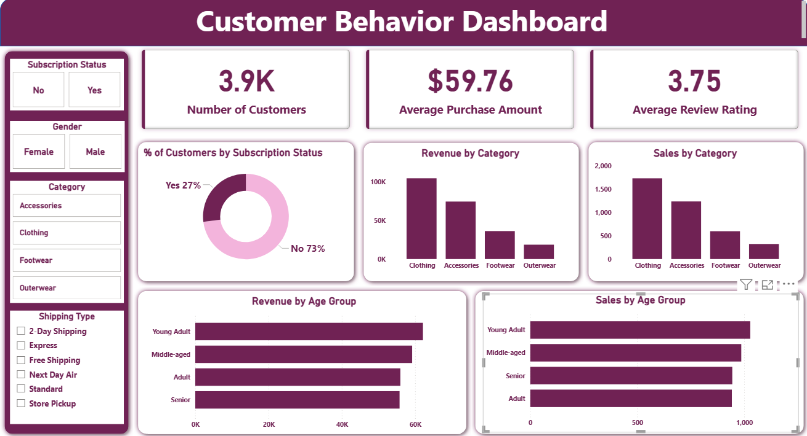

# Customer-Behavior-Analysis

## Overview
This project analyzes customer shopping behavior to help a retail business understand purchasing patterns, improve customer engagement, and optimize sales strategies.

**Business Question:**  
How can customer data be leveraged to identify trends, improve customer engagement, and optimize marketing and product strategies? 

The project covers the complete data analytics lifecycle — from data cleaning and exploration to SQL analysis, dashboard creation, and business recommendations.

---

## Dashboard Preview

> Interactive Power BI dashboard showing customer insights, revenue trends, and segmentation.

---

## Dataset
- **Total Records:** 3,900  
- **Columns:** 18  
- **Key Features:**
  - Customer demographics (Age, Gender, Location, Subscription Status)
  - Purchase details (Item Purchased, Category, Purchase Amount, Season, Size, Color)
  - Shopping behavior (Discount Applied, Frequency, Review Rating, Shipping Type)
- **Data Quality:** Missing values in review ratings handled during preprocessing 

---

## Tools & Technologies
- Python (Pandas, NumPy)
- PostgreSQL
- SQL
- Power BI
- MS PowerPoint

---

## Project Workflow

### 1. Data Loading & Cleaning (Python)
- Loaded dataset using pandas  
- Handled missing values using median imputation  
- Standardized column names  
- Created new features (age groups, purchase frequency)  
- Removed redundant columns  

### 2. Exploratory Data Analysis (EDA)
- Analyzed purchase patterns and distributions  
- Identified trends across categories and customer segments  
- Studied impact of discounts and ratings on purchases  

### 3. Database Integration (PostgreSQL)
- Loaded cleaned data into PostgreSQL  
- Structured data for efficient querying  

### 4. SQL Analysis
Performed business-driven queries:
- Revenue by gender  
- High-spending discount users  
- Top-rated products  
- Subscription vs non-subscription behavior  
- Customer segmentation (New, Returning, Loyal)  
- Revenue by age group 

---

## Dashboard (Power BI)
- KPI cards (Total Customers, Avg Purchase, Ratings)  
- Revenue by category  
- Sales distribution  
- Customer segmentation  
- Filters (Category, Gender, Shipping Type)  

---

## Key Insights
- Discounts increase engagement but may reduce margins  
- Loyal customers form the largest segment  
- Certain products perform better with discounts  
- Younger and middle-aged customers contribute more revenue  
- Subscription behavior impacts purchasing patterns  

---

## Business Recommendations
- Promote subscription programs  
- Build loyalty programs for repeat customers  
- Optimize discount strategies  
- Focus marketing on high-performing products  
- Target high-value customer segments 

---

## Conclusion
This project demonstrates an end-to-end data analytics workflow, combining technical skills with business understanding to generate actionable insights and support decision-making.
